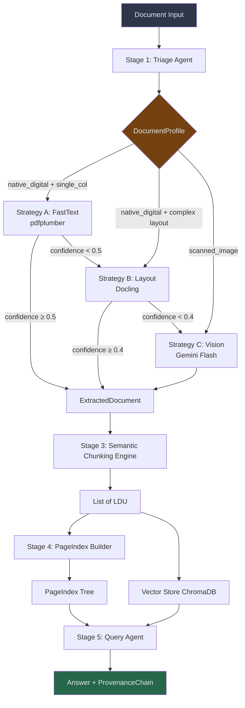

# DOMAIN_NOTES.md — Document Intelligence Refinery
## Phase 0: Domain Onboarding Primer

---

## 1. Pipeline Architecture



---

## 2. Extraction Strategy Decision Tree

```
START
│
├─ Is PDF readable (character stream > 10 chars/1000pt²)?
│   │
│   YES → image_ratio < 30%?
│   │   │
│   │   YES → STRATEGY A (FastText / pdfplumber)
│   │   │       Confidence check: chars_per_page ≥ 100 AND font metadata present
│   │   │       If confidence < 0.5 → escalate to Strategy B
│   │   │
│   │   NO (30-70% image) → origin = mixed → STRATEGY B (Layout / Docling)
│   │       Column clusters ≥ 2 → multi_column → STRATEGY B
│   │       Table coverage > 30% → table_heavy → STRATEGY B
│   │       If confidence < 0.4 → escalate to Strategy C
│   │
│   NO → image_ratio > 70%?
│       │
│       YES → STRATEGY C (Vision / Gemini Flash)
│       │       Budget guard: max 50 pages, $0.10 cap/doc
│       │
│       NO → intermediate → STRATEGY B fallback
│
OUTPUT: ExtractedDocument with bounding boxes, tables, figures
```

---

## 3. Corpus Analysis & Observed Failure Modes

### Class A: CBE Annual Report 2023-24 (native digital)
- **Origin:** native_digital (char_density ~450 chars/1000pt²)
- **Layout:** mixed (narrative + tables + figures)
- **Domain:** financial
- **Observed Failures:**
  - Multi-column text on front pages confuses single-pass ordering
  - Tables spanning headers across pages lose column alignment
  - Footnote text gets merged with main body in naive extraction
  - **Fix:** Use Docling (Strategy B) for layout-aware block ordering

### Class B: Audit Report 2023.pdf (scanned image)
- **Origin:** scanned_image (char_density ~0, all image)
- **Layout:** single_column (audit report format)
- **Domain:** financial/legal
- **Observed Failures:**
  - pdfplumber returns ZERO characters — complete failure of Strategy A
  - Low-DPI scans cause OCR artifacts (fi → fi ligature errors)
  - Stamps and signatures misidentified as text blocks
  - **Fix:** Strategy C (Gemini Vision) handles scanned pages; 300 DPI rendering recommended

### Class C: FTA Performance Survey Report 2022 (mixed)
- **Origin:** mixed (text sections + embedded tables)
- **Layout:** mixed (narrative + assessment grids)
- **Domain:** technical/legal
- **Observed Failures:**
  - Assessment score tables rendered as images embedded in PDFs → Strategy A misses them
  - Multi-level numbered hierarchy (1.1.2.3) confuses flat OCR output
  - **Fix:** Strategy B (Docling) detects table bounding boxes even when image-embedded

### Class D: Tax Expenditure Report (table-heavy)
- **Origin:** native_digital
- **Layout:** table_heavy (multi-year fiscal data tables)
- **Domain:** financial
- **Observed Failures:**
  - Tables with merged cells (rowspan/colspan) collapse to wrong row counts
  - Percentage values (%) parsed as text rather than numeric
  - Multi-page tables lose header on continuation pages
  - **Fix:** Strategy B with Docling table cell merger detection

---

## 4. Character Density Analysis (Empirical Thresholds)

| Document | Char Density (chars/1000pt²) | Image Ratio | Strategy |
|---|---|---|---|
| CBE Annual Report 2023-24 | ~380 | ~0.12 | B (table_heavy) |
| Audit Report 2023 | ~0 | ~0.98 | C (scanned) |
| FTA Survey 2022 | ~150 | ~0.25 | B (mixed) |
| Tax Expenditure 2022 | ~420 | ~0.05 | B (table_heavy) |
| Simple text PDFs | >500 | <0.05 | A (fast_text) |

**Thresholds derived:**
- `scanned_max_char_density = 10.0` (below this → scanned)
- `digital_min_char_density = 50.0` (above this → likely digital)
- `scanned_min_image_ratio = 0.70` (above this → scanned)

### Phase 2 Confidence Signals (Strategy A)

- **Minimum characters per page:** `100` — below this, pdfplumber output is unreliable and should escalate.
- **Target character density:** `150 chars/1000pt²` — healthy native-digital PDFs land above this; lower values degrade confidence proportionally.
- **Image ratio guardrail:** `50%` page-area image coverage begins to penalize; `>80%` forces confidence ≤0.2 to trigger escalation.
- **Font metadata bonus:** +0.1 to confidence when embedded fonts are present (strong digital signal).

The combined score = `0.45*text_volume + 0.35*density + 0.15*image_penalty + font_bonus`, capped to `[0,1]` and downweighted for image-heavy pages. Escalation thresholds: `<0.5` (Strategy A → B), `<0.4` (Strategy B → C).

---

## 5. VLM vs OCR Cost Tradeoff

| Metric | Strategy A | Strategy B | Strategy C |
|---|---|---|---|
| Tool | pdfplumber | Docling | Gemini 1.5 Flash |
| Speed | ~0.5s/page | ~5s/page | ~3s/page (API) |
| Cost | $0 | $0 (local) | ~$0.0004/page |
| Table Quality | Poor (flat text) | Good (structured JSON) | Excellent (vision) |
| Scanned PDFs | ❌ Fails | ⚠️ Partial (if has text) | ✅ Full support |
| Multi-column | ⚠️ Mixed | ✅ Native support | ✅ Full support |
| Equations | ❌ | ✅ (formula detection) | ✅ |

**Client-facing articulation:**
> "We run three extraction tiers. Fast text costs nothing and works in milliseconds on clean digital PDFs. Layout-aware analysis handles complex tables and multi-column text without API calls. Vision extraction is our last resort—it can read anything a human can, but at ~$0.40 per 1000-page document. For a 365-page annual report, total Vision cost is under $0.15. We only invoke it when our confidence scoring detects we'd otherwise produce hallucinated data."

---

## 6. Provenance Model

Every extracted fact carries spatial addressing:
```json
{
  "document_name": "CBE ANNUAL REPORT 2023-24.pdf",
  "page_number": 42,
  "bbox": {"x0": 72.0, "y0": 234.5, "x1": 540.0, "y1": 280.2},
  "content_hash": "sha256:a3f2...",
  "strategy_used": "layout_extractor",
  "confidence_score": 0.87
}
```

This is the document equivalent of Week 1's `content_hash`—spatial addressing that remains valid even when surrounding text moves. The `bbox` allows an auditor to open the PDF to the exact pixel coordinates of any extracted claim.
