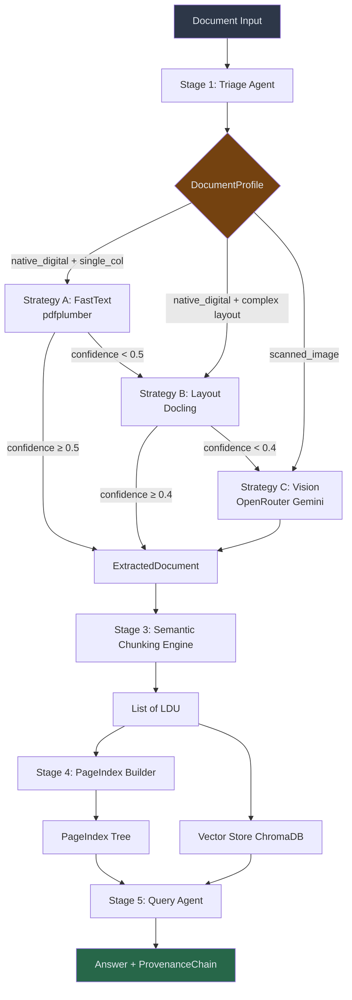
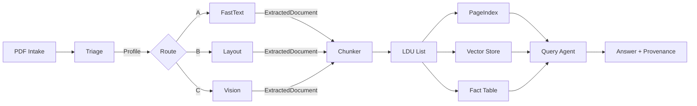

# Interim Submission — Thursday 03:00 UTC

## 1. Domain Notes (Phase 0 Deliverable)

### 1.1 Extraction Strategy Decision Tree

### 1.2 Failure Modes Observed Across Document Types
- **Native digital, mixed layout (e.g., annual reports):** multi-column pages and large tables break reading order; pdfplumber alone flattens tables → mitigated by Strategy B (Docling).
- **Scanned/image-heavy:** pdfplumber returns near-zero characters; signatures/stamps misidentified → mitigated by Strategy C (vision) after triage or low-confidence escalation.
- **Embedded-image tables:** tables rendered as images get missed by text-only extraction → mitigated by Strategy B table detection or Strategy C vision.
- **Table-heavy fiscal reports:** merged cells and header continuations across pages lose alignment → mitigated by Strategy B structure preservation.

### 1.3 Pipeline Diagram (Mermaid)

---

## 2. Architecture Diagram (5-Stage Pipeline & Routing)
- **Stage 1:** Triage → `DocumentProfile` (origin_type, layout, cost hint).
- **Stage 2:** Extraction Router with escalation A→B→C based on confidence thresholds (fast_text_min=0.5, layout_min=0.4).
- **Stage 3:** Semantic Chunking Engine (enforces 5 rules: tables atomic, figure captions in metadata, list integrity, headers as parents, cross-reference linking; respects max_tokens/min_tokens_for_split).
- **Stage 4:** PageIndex Builder (section tree + LLM/fallback summaries + key entities; stored under `.refinery/pageindex`).
- **Stage 5:** Query Agent (PageIndex traversal → vector search → fact table; deterministic or LLM-orchestrated). Ledger + provenance maintained.

Routing logic:
- If `estimated_cost == fast_text_sufficient`: use Strategy A; if confidence <0.5 → B; if still <0.4 → C.
- If `estimated_cost == needs_layout_model`: use Strategy B; if confidence <0.4 → C.
- If `estimated_cost == needs_vision_model`: use Strategy C directly (budget guard enforces caps).

---

## 3. Cost Analysis (Per-Document Estimates)
| Strategy | Tooling | Cost Model | Typical Pages | Est. Cost / Doc | Notes |
|---|---|---|---|---|---|
| A: FastText | pdfplumber | Local CPU | Any | ~$0.00 | Fastest; confidence-gated to avoid bad outputs |
| B: Layout | Docling (local) | Local CPU | 10–200 | ~$0.00 | Slower than A; preserves tables/multi-column |
| C: Vision | OpenRouter Gemini 1.5 Flash | Input: $0.075 / 1M toks; Output: $0.30 / 1M toks | 50 pages (cap) | ~$(0.000038 × pages) ≈ $0.002 per 50 pages | Budget guard: max $0.10 per doc, max 50 pages processed |

Assumptions:
- Vision token estimate: ~500 tokens/page → input cost ~$0.000038/page, output similar order; capped at $0.10/doc.
- Strategies A/B are free aside from CPU time; choose them whenever confidence permits.

---

## 4. Current Corpus Coverage (as of latest run)
- Profiles generated: 16 total in `.refinery/profiles/`.
- Class mix: native_digital=10, mixed=3, scanned_image=3 (form_fillable=0 observed in corpus).
- Ledger: `.refinery/extraction_ledger.jsonl` populated via `src.main extract` runs.
- PageIndex: entries produced via `src.main index` alongside the above profiles.

## Appendix: References to Deliverables
- **Domain Notes:** See Section 1 and thresholds documented in `DOMAIN_NOTES.md`.
- **Architecture & Routing:** See Section 2 and `rubric/extraction_rules.yaml` for thresholds and chunking constitution.
- **Costs:** Based on Gemini Flash pricing and enforced budget guard in `VisionExtractor`.
